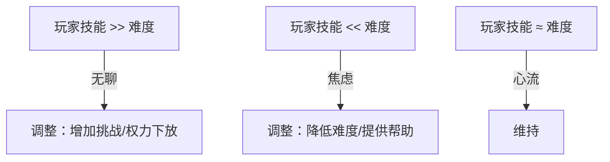

# 框架设计 Skill

> 框架（Framework）≠ 单个机制，而是一组系统通过链接构成的整体体验结构，其目标是让玩家在游玩中感到心理舒适——即处于心流通道内、获得稳定的正反馈、拥有自主感与胜任感。

---

## 🪶 框架设计速查

| 如果你需要...                         | 读哪里                   |
| ------------------------------------- | ------------------------ |
| 理解框架的本质（vs 单机制 vs 工作流） | 核心定义 + 对比表        |
| 检查是否需要新增一个系统              | 原则一（奥卡姆剃刀）     |
| 评估新系统的性价比                    | 原则二（快乐密度）       |
| 选择内在 vs 外在驱动力                | 原则三（驱动力优先）     |
| 设计策略/决策游戏的深度               | 原则四（相对最优解空间） |
| 从零开始设计一个框架                  | 一、框架设计流程（6 步） |
| 看不同类型的框架案例                  | 二、框架类型图谱         |
| 考虑时间压力对设计的影响              | 三、时间压力与设计决策   |
| 避免已知设计陷阱                      | §四 设计陷阱             |
| 框架设计完成后逐条验证                | 流程步骤 6 的自检清单    |

---

## 核心定义

**框架** = 由多个机制通过系统交互链接而成的、让人在游玩中感到心理舒适的体验架构。

进一步说，框架在本质上也是**组织游戏内容的方式**——它决定了：
- **呈现**：玩家在游戏中能看到什么、以什么顺序看到
- **行为**：玩家在游戏中能做什么、不能做什么
- **体验**：玩家的快乐如何被生成、节奏如何被调节

不同类型的框架本质上是不同的"内容组织策略"，各有其主导的设计原则。**本篇 Skill 以「相对最优解（Relative Optimal Solution）」为核心组织原则展开**，辅以其他通用原则做补充。

> 相对最优解只是诸多可用的组织原则之一。其他原则包括陈星汉的 Flow 理论、叙事驱动设计、表达驱动设计等。本 Skill 聚焦相对最优解因为它对策略/决策型游戏有广泛的指导意义，且是当前知识库中积累最深的方向。

### 框架的三个构成要素

| 要素         | 说明                                      | 自检问题                                   |
| ------------ | ----------------------------------------- | ------------------------------------------ |
| **机制集合** | 构成框架的多个独立机制/系统               | 这些机制各自解决了什么问题？               |
| **系统链接** | 机制之间的交互关系（输入/输出/触发/约束） | 机制之间如何相互影响？缺失一个系统会怎样？ |
| **心理舒适** | 玩家在框架中获得的整体体验质量            | 玩家在这个框架中感到舒适还是焦虑/无聊？    |

### 框架 vs 单机制 vs 工作流

| 维度   | ❌ 单机制          | ✅ 框架                       | ❌ 工作流       |
| ------ | ----------------- | ---------------------------- | -------------- |
| 范围   | 一个孤立规则/系统 | 多个系统的链接结构           | 步骤化流程     |
| 目标   | 解决单一设计问题  | 创造持续的心理舒适体验       | 完成特定任务   |
| 涌现性 | 低                | 中-高（系统交互产生涌现）    | 低（预设路径） |
| 示例   | 商店系统          | 商店+经济+升级+难度=内线框架 | 调试流程       |

---

## 核心原则

框架设计应遵循四项原则。前三项是通用底线——无论做什么类型的游戏都应考虑。第四项是本设计方向的深化，专注于我们对策略/决策类游戏的深度适配与边界探索。

> 位置说明：前三项原则是所有品类的必修课，第四项是我们设计方向的必修课。如果您做的不是策略/决策型游戏，原则四是加分项；但对我们探索的方向来说，它是核心工具。

### 原则一：奥卡姆剃刀——如无必要，勿增实体

**表述**：框架中的每一个系统/机制都必须是必要的。如果不能明确回答"移除这个系统会失去什么？"，那么这个系统就不应该存在。

**自检清单**：
- 这个系统解决了什么**不可替代**的问题？
- 能否通过现有系统的扩展来达成同样的目的？
- 移除这个系统，框架的核心体验是否仍然完整？
- 这个系统的存在是否增加了玩家的认知负担而没有带来相应的体验回报？
- ≥ 这个系统是否贡献了至少一个维度的相对最优解空间？如果否，考虑能否通过优化已有系统来替代

**决策指引**：
```
考虑新增系统时：
  先问："没有它行不行？"
  → 行 → ❌ 不加
  → 不行 → 进入原则二的判断
```

**参考**：`理论知识/33-无效进程与三层乐趣体系.md`（减少无效进程）、`理论知识/44-游戏平衡性设计.md`（系统复杂度的代价）

---

### 原则二：快乐总量/进程比率——每单位进程的快乐产出

**表述**：在考虑向框架中添加新系统时，需严格评估**快乐总量增量**与**进程增量**的比值。系统的价值不取决于它"提供了什么"，而取决于它**以多少进程换来了多少快乐**。

**核心公式**：
```
快乐密度变化 = 快乐总量增幅 ÷ 进程增幅

判断标准：
  ❌ 快乐密度下降（进程↑但快乐总量不变或↓）→ 失败，不应加入
  ⚠️ 快乐密度持平（增幅比例相当）→ 需判断是否有更优方案
  ✅ 快乐密度显著提升（快乐总量增幅 >> 进程增幅）→ 值得加入
```

**三类情况判断逻辑**：

| 情况  | 快乐总量 | 进程     | 快乐密度   | 结论                                                                     |
| :---- | :------- | :------- | :--------- | :----------------------------------------------------------------------- |
| **A** | 不变     | 增加     | 下降       | ❌ **失败**——系统稀释了体验密度，框架变"水"了                             |
| **B** | 增加     | 增加     | 持平或略升 | ⚠️ **谨慎**——评估能否通过优化现有系统（叠层/协同/涌现）而非新增系统来达成 |
| **C** | 大幅增加 | 少量增加 | 显著提升   | ✅ **值得**——高效率的系统，确认不影响原则一和三后加入                     |

**设计原则**：优先通过**丰富现有系统的交互**（涌现式链接、机制轴配合、协同效应）来提升快乐总量，而非通过新增系统来堆砌。新增系统是最后手段。

**参考**：`理论知识/18-快乐总量.md`、`理论知识/33-无效进程与三层乐趣体系.md`、`理论知识/17-快车道设计.md`

---

### 原则三：驱动力优先——内在驱动力 > 外在驱动力

**表述**：玩家在框架中必须有清晰的内在目标，内在驱动力的价值远大于外在驱动力。当存在多种系统方案时，优先选择提供内在驱动力的方案。

**设计哲学：母系与父系**

本原则包含两种设计哲学，它们不是框架类型，而是指导"如何落地驱动力优先"的理念：

| 哲学                       | 倾向的驱动力   | 设计方式                     | 适用场景                       |
| :------------------------- | :------------- | :--------------------------- | :----------------------------- |
| **母系哲学**（玩家中心）   | 内在驱动力主导 | 权力下放、涌现、多样选择     | 探索、创造、表达、自由构筑     |
| **父系哲学**（设计师中心） | 外在驱动力辅助 | 精心编排、线性引导、节奏控制 | 叙事、教学、情感曲线、预设体验 |

> 两者并非对立，可混合使用——好的游戏通常是"父系的骨架 + 母系的血肉"。例如开放世界中的主线任务（父系） + 自由探索（母系）。

**参考**：`理论知识/08-父系与母系设计哲学.md`

**内在驱动力 vs 外在驱动力**：

| 维度             | 内在驱动力       | 外在驱动力             |
| :--------------- | :--------------- | :--------------------- |
| 行为动机         | 行为本身就是奖励 | 行为是手段，奖励是目的 |
| 玩家状态         | "我想做"         | "我得做"               |
| 持续时长         | 长久，不易消退   | 奖励移除后消退         |
| 过程体验         | 过程吸引度主导   | 结果吸引度主导         |
| 过度理由效应风险 | 低               | 高——外驱可能挤出内驱   |

**决策指引**：
```
为框架选择新系统时：
  方案A（提供内在驱动力） vs 方案B（提供外在驱动力）
  → 优先评估方案A能否满足需求
  → 只有方案A确实不可行时，才考虑方案B

如果两个方案都可行：
  → 选择方案A（即使它的效率表面上看低于方案B）
```

**自检问题**：
- 玩家使用这个系统时，是因为"想玩"还是"不得不玩"？
- 移除这个系统的所有外部奖励后，玩家还会用它吗？
- 这个系统是否在培养玩家的内在兴趣，还是仅仅在堆砌外在刺激？

**参考**：`理论知识/21-驱动力模型.md`、`理论知识/48-自我决定理论SDT.md`、`理论知识/09-过度理由效应.md`、`理论知识/75-心理力学模型.md`、`理论知识/08-父系与母系设计哲学.md`

---

### 原则四：相对最优解空间——撑开决策的变化层次

**定位声明**：本条原则是本设计方向的深化。前三项原则是通用底线（任何品类都适用），原则四则专注于策略/决策类游戏的深度适配，也是我们探索游戏边界时最核心的工具。

**根本目标**：创造**体验多样性**——让玩家的每一局/每一次经历都是一次不同的体验。有意义的决策是手段，多样化的体验是目的。

**表述**：框架中的每一个系统都必须贡献至少一层相对最优解空间——L1(问题变化)或L2(解答方式变化)或L3(规则变化)——且在贡献的同时不坍缩其他层的空间。

**三层变化定义**：

| 层级                 | 变化什么                      | 实现方式                     | 为主时的框架类型   |
| :------------------- | :---------------------------- | :--------------------------- | :----------------- |
| **L1(问题变化)**     | 敌人/地图/事件——玩家面对什么  | 随机环境、程序生成、动态难度 | 心流框架           |
| **L2(解答方式变化)** | 卡牌/角色/Build——玩家拥有什么 | 构筑多样性、机制轴、协同效应 | 协同/涌现/双轨框架 |
| **L3(规则变化)**     | 游戏底层规则——游戏怎么运作    | 规则变异、外因改变、Prestige | 增量框架           |

**自检问题**：
- 这个系统增加了玩家面对的问题的变化吗？（L1——更多样的敌人/地图/事件）
- 这个系统增加了玩家解答方式的变化吗？（L2——更多样的构筑路径/协同可能）
- 这个系统增加了规则层面的变化吗？（L3——规则变异/外因改变）
- 如果三层都不贡献→考虑能否通过现有系统的扩展来替代
- 如果贡献了某一层→检查是否同时导致了另一层的坍缩（协同悖论——见下方注意事项）

**体验多样化的完整链路**：
```
体验多样化 → 新情境产生 → 认知过程启动（思考/判断/决策）
  → 答案验证 → 多元正反馈后果：
     智力优越感（"我想到了"）
     惊喜感（"居然会这样？"）
     掌控感（"我能应对"）
     探索满足（"和我想的一样/不一样"）
     情感沉浸（投入度更高）
     表达/创造（留下自己的痕迹）
     可玩性/重玩（每次都不一样）
     学习积累（越来越懂系统）
```

**三层变化与正反馈后果的映射**：

|  | 智力 | 惊喜 | 掌控 | 探索 | 情感 | 表达 | 可玩 | 学习 |
|              | 优越感 |  感   |  感   | 满足  | 沉浸  | 创造  |  性   | 积累  |
| ------------ | :----: | :---: | :---: | :---: | :---: | :---: | :---: | :---: |
| L1(问题变化) |  ▫️弱   |  ✅强  |  ▫️弱  |  ✅强  |  ✅中  |  ▫️弱  |  ✅强  |  ▫️弱  |
| L2(解答变化) |  ✅强   |  ✅中  |  ✅强  |  ✅中  |  ✅中  |  ✅强  |  ✅强  |  ✅强  |
| L3(规则变化) |  ✅强   |  ✅强  |  ▫️弱  |  ✅强  |  ✅中  |  ▫️弱  | ✅极强 |  ▫️弱  |
| 三层协同     | ✅极强  |  ✅强  |  ✅强  |  ✅强  |  ✅强  |  ✅中  | ✅极强 |  ✅中  |

**设计者可根据想要的体验效果选择在哪层发力。** 例如目标是表达/创造和学习积累→优先L2；目标是惊喜感和可玩性→L1和L3更高效。

**核心张力**：智力优越感与惊喜感之间存在设计张力——"我想到了"需要情境可推理，"我想都没想过"需要情境不可预测。设计时需根据目标体验做取舍。

**参考**：`理论知识/79-相对最优解与三层变化模型.md`、`理论知识/77-规则变异设计.md`、`理论知识/11-机制轴设计方法.md`、`理论知识/29-体验图分析框架.md`、`理论知识/41-涌现式设计.md`

---

## 一、框架设计流程

### 步骤 1：识别框架需求

在开始设计前，先确认是否需要框架：

- **需要框架的场景**：玩家需要长期停留的系统（如核心循环、内线/外线结构、成长系统）
- **不需要框架的场景**：一次性功能、纯工具系统、单个简单规则

**设计前置问题**：
1. 这个框架要支撑玩家多长时间的体验？
2. 玩家在此框架中的核心情感目标是什么？（胜任感/自主感/归属感/放松感）
3. 当前设计中是否存在碎片化的机制，缺乏链接？

### 步骤 2：定义核心循环

框架的核心是一条或多条循环链路。先画出核心循环：


**参考知识库**：
- `理论知识/46-正反馈与负反馈循环.md` — 正/负反馈循环的设计原则
- `理论知识/45-增量游戏设计.md` — 增量游戏的核心循环模式
- `理论知识/34-系统交互与体验调节.md` — 系统间的交互形式

### 步骤 3：设计系统链接

定义框架中各机制的链接方式：

| 链接类型         | 说明                       | 知识库参考                 |
| ---------------- | -------------------------- | -------------------------- |
| **产出互为需求** | 系统A的产出是系统B的输入   | `34-系统交互与体验调节.md` |
| **外因改变**     | 外部环境变化改变选择       | `34-系统交互与体验调节.md` |
| **体验产出移动** | 体验结果产生位移           | `34-系统交互与体验调节.md` |
| **渐进式生成**   | 根据行为生成新体验         | `13-渐进式生成.md`         |
| **机制轴配合**   | 多个机制围绕同一轴自然协同 | `11-机制轴设计方法.md`     |

**关键原则**：
- 链接应让玩家**可以利用**该系统，而非被动接受
- 避免高度耦合（牵一发而动全身）
- 确保虚构层统一（规则一致性）

### 步骤 4：检验心理舒适性

框架的最终目标是让玩家感到心理舒适。从以下维度检验：

#### 4.1 心流适配



**参考**：`理论知识/36-心流通道.md`、`理论知识/43-游戏节奏设计.md`、`理论知识/20-难度调节方案.md`

#### 4.2 快乐总量

检视框架内的正反馈与负反馈总和：
- **增加正反馈技法**：协同效应、叠层设计、投篮效应、双轨收益、快车道设计
- **减少负反馈技法**：浪费规避、分段奖励、积极离场、无损重来
- **减少无效进程**：压缩低正反馈环节，填充 Easy Fun

**参考**：`理论知识/18-快乐总量.md`、`理论知识/33-无效进程与三层乐趣体系.md`、`理论知识/17-快车道设计.md`

#### 4.3 权力下放

玩家在框架中拥有哪些控制权？

| 权力类型   | 自检问题                      |
| ---------- | ----------------------------- |
| 游戏节奏权 | 玩家能否控制节奏快慢？        |
| 难度选择权 | 玩家能否选择挑战层级？        |
| 身份定义权 | 玩家能否定义自己的角色/风格？ |
| 体验选择权 | 玩家能否选择内容/顺序？       |

**参考**：`理论知识/22-权力下放设计.md`、`理论知识/48-自我决定理论SDT.md`

#### 4.4 信号与强化

框架中的反馈是否清晰、恰当？

- 奖励与行为的因果关系是否明确？（鸽子实验）
- 使用了哪种强化程式？（连续/固定比率/可变比率/固定时距/可变时距）
- 信号是否能提前激活期待感？
- 是否避免了过度理由效应？（外驱挤出内驱）

**参考**：`理论知识/37-信号与强化体系.md`、`理论知识/09-过度理由效应.md`

#### 4.5 心理力学平衡

玩家在框架中的行为改变倾向是否合理？

```
行为改变倾向 = 过程吸引度 + 结果吸引度 
             - 过程排斥度 - 结果排斥度 
             - 当前行为惯性 - 改变成本
```

- 框架是否提供了足够的过程/结果吸引度？
- 框架中是否存在过高的行为惯性和改变成本？
- 是否需要通过系统交互调节驱动力？

**参考**：`理论知识/75-心理力学模型.md`、`理论知识/21-驱动力模型.md`

### 步骤 5：检查涌现性与协同

好的框架允许玩家发现"意料之外、情理之中"的组合：

- 机制之间是否产生了**涌现式协同**（以行为为条件）而非说明书式协同（以Tag为条件）？
- 是否可以使用**机制轴设计方法**让协同自然发生？
- 框架中是否有**玩具系统**（非必要但有趣）的余地？

**参考**：`理论知识/41-涌现式设计.md`、`理论知识/35-协同效应.md`、`理论知识/32-玩具系统.md`、`理论知识/11-机制轴设计方法.md`

### 步骤 6：框架验证

设计完成后，逐条检查：

| #   | 自检项         | 通过标准                                                                                                               |
| --- | -------------- | ---------------------------------------------------------------------------------------------------------------------- |
| 1   | 机制完整性     | 每个机制有明确的设计目的，无冗余机制                                                                                   |
| 2   | 奥卡姆剃刀     | 每个系统都是必要的，移除任何一个都会导致核心体验受损                                                                   |
| 3   | 快乐密度       | 快乐总量增幅 > 进程增幅，体验密度未稀释                                                                                |
| 4   | 相对最优解空间 | 每个系统贡献了至少一层的相对最优解空间（L1(问题变化)/L2(解答方式变化)/L3(规则变化)），且在贡献的同时不坍缩其他层的空间 |
| 5   | 驱动力健康     | 内在驱动力主导 > 外在驱动力，不存在过度理由效应风险                                                                    |
| 5   | 链接清晰度     | 系统间的交互关系可描述、可预测                                                                                         |
| 6   | 心理舒适性     | 玩家在心流通道内的时间 > 60%                                                                                           |
| 7   | 正反馈主导     | 正反馈总量 >> 负反馈总量                                                                                               |
| 8   | 权力适切       | 玩家有足够但不泛滥的控制权                                                                                             |
| 9   | 涌现可能性     | 存在多种有效玩法路径，非单一最优解                                                                                     |
| 10  | 扩展性         | 新增机制能自然融入框架，无需大规模重写                                                                                 |
| 11  | 认知负担       | 框架整体复杂度不超出目标玩家的认知负荷                                                                                 |

---

## 二、框架类型图谱

框架类型是按**相对最优解在哪个层次制造变化**来划分的。所有类型的共同目标是创造持续多样的体验——下面的分类是按它们主要在哪一层实现变化来组织的。

> 父系与母系不是本图谱中的框架类型，而是设计哲学——见核心原则三。

### L1(问题变化) 为主的类型

| 框架类型     | 核心特征                                 | 代表理论         | 典型应用           |
| ------------ | ---------------------------------------- | ---------------- | ------------------ |
| **心流框架** | 挑战与技能动态平衡，通过难度变化维持专注 | `36-心流通道.md` | 动作游戏、关卡设计 |

### L2(解答方式变化) 为主的类型

| 框架类型     | 核心特征                         | 代表理论                   | 典型应用            |
| ------------ | -------------------------------- | -------------------------- | ------------------- |
| **协同框架** | 多维度属性相乘产生1+1>2效应      | `35-协同效应.md`           | 自走棋、Build构筑   |
| **涌现框架** | 多系统交互产生意料之外的组合效果 | `41-涌现式设计.md`         | 沙盒游戏、模拟游戏  |
| **双轨框架** | 固定收益+随机惊喜的双重奖励结构  | `26-双轨收益与强化程式.md` | 卡牌构筑、Roguelike |

### L3(规则变化) 为主的类型

| 框架类型     | 核心特征                                         | 代表理论             | 典型应用             |
| ------------ | ------------------------------------------------ | -------------------- | -------------------- |
| **增量框架** | 持续自动产出→消耗升级→效率提升，Prestige重置规则 | `45-增量游戏设计.md` | 放置游戏、增量自走棋 |

### 跨层/混合类型

| 框架类型     | 核心特征                                   | 代表理论         | 典型应用         |
| ------------ | ------------------------------------------ | ---------------- | ---------------- |
| **玩具框架** | 非必要的深度系统，纯内驱驱动，通吃三层变化 | `32-玩具系统.md` | 异星工厂火车系统 |

> 实际设计中，一个游戏通常**混合使用多种框架类型**。例如增量自走棋 = 增量框架（L3）+ 心流框架（L1）+ 协同框架（L2）。

---

## 三、时间压力与设计决策

时间压力是一个独立于三层变化模型的设计轴。它不改变相对最优解的存在，但决定玩家能感知到多少相对最优解空间。人是有极限的——我们不应当让一个限时1秒钟的决策变得极其复杂。

### 不同时间压力下的 ROS 空间形状

| 类型                              | 时间压力 | ROS 空间特征                    | 设计重心               |
| :-------------------------------- | :------- | :------------------------------ | :--------------------- |
| **无时间压力**（回合制策略/构筑） | 无限制   | L1/L2/L3 三层都可充分展开       | L2(解答方式变化) 做深  |
| **有时间压力但不大**（动作RPG）   | 秒级     | L1 丰富，L2 折叠到战前/预读层   | L1 频率 + 战前 L2 配置 |
| **高时间压力**（格斗/音游）       | 帧级     | L1 高频变化，L2 执行深度，L3 低 | L1 频率 × 执行精度     |

### L2(解答方式变化) 在高时间压力下的折叠

低时间压力下 L2 是横向展开的（"很多选项可选"）。高时间压力下 L2 被折叠：

**折叠形式一：预读层**
格斗游戏的一瞬间——在对手出招前预判他的行动。这不是"宽选择"（你不能临时换选项），而是"深判断"（读心 + 条件反射）。L2 被折叠到了"决策树的根"——选择不是在响应时做，而是在响应前就决定了。

**折叠形式二：战前配置/局外层**
角色选择、装备搭配、天赋配置——这些是正常的 L2 空间（"我选择用什么方式战斗"），但一旦选定，战斗中就不会大变。L2 被折叠到了游戏外/局间。

### 实践指导

```
根据目标游戏的时间压力水平选择 ROS 落地方式：

无时间压力（杀戮尖塔等）
  → L2(解答方式变化) 做深，让玩家尽情探索构筑组合

有时间压力但不大（黑魂/动作RPG）
  → L1(问题变化) 做丰富，L2 放在战前准备阶段

高时间压力（格斗/音游/FTG）
  → L1 变化频率够高，L2 依靠玩家预读精度和执行精度
```

## 快速自检清单

设计完成后，用步骤 6 的 [框架验证表](#步骤-6框架验证) 逐条检查（11 项）。新增以下自检项：

- [ ] Frontmatter 使用标准 `---` 格式（非 ` ```yaml `）
- [ ] 引用的知识库路径有效
- [ ] 设计决策有明确的"为什么选这个"的推论依据

---

## §四 设计陷阱

| 陷阱             | 表现                             | 解决方法                                         |
| ---------------- | -------------------------------- | ------------------------------------------------ |
| **过度耦合**     | 调整一个机制导致整个框架崩塌     | 保持链接松散，使用中间层/共享状态解耦            |
| **路径依赖**     | 玩家一旦选择某个方向就不愿切换   | 引入外因改变、体验产出移动、渐进式生成           |
| **负反馈过重**   | 框架中惩罚机制过多，触发损失厌恶 | 使用小负反馈替代大负反馈，策略B（错误→小正反馈） |
| **认知过载**     | 框架复杂度超出玩家理解能力       | 渐进式引入（先核心后扩展），母系设计（先玩后学） |
| **目标空心化**   | 框架持续运行但玩家没有明确目标   | 加入阶段性目标、里程碑事件、目标梯度效应         |
| **节奏单一**     | 框架中长时间无节奏变化           | 加入峰谷设计、节奏权下放、快车道                 |
| **忽视离场体验** | 玩家离开时感到疲劳或失落         | 设计积极离场（海明威效应）、安全网、进度保留     |

**参考**：`理论知识/38-叙事中的父系结构设计.md`（切入点与退出设计）

---

## 五、参考知识库速查

### 核心理论（必须读）

| 文档                                      | 核心价值                                  |
| ----------------------------------------- | ----------------------------------------- |
| `理论知识/34-系统交互与体验调节.md`       | 系统链接的四种形式与局限                  |
| `理论知识/36-心流通道.md`                 | 心理舒适的核心模型                        |
| `理论知识/46-正反馈与负反馈循环.md`       | 反馈循环的设计原则                        |
| `理论知识/18-快乐总量.md`                 | 正反馈技法全集                            |
| `理论知识/37-信号与强化体系.md`           | 强化程式选择策略                          |
| `理论知识/75-心理力学模型.md`             | 行为改变倾向公式                          |
| `理论知识/65-MDA框架.md`                  | 三层分析视角                              |
| `理论知识/79-相对最优解与三层变化模型.md` | 本 skill 的理论基座——体验多样化与三层变化 |

### 扩展理论（按需读）

| 文档                                    | 适用场景                     |
| --------------------------------------- | ---------------------------- |
| `理论知识/41-涌现式设计.md`             | 需要系统间产生意外效果时     |
| `理论知识/11-机制轴设计方法.md`         | 需要自然协同而非硬写触发时   |
| `理论知识/22-权力下放设计.md`           | 需要让玩家拥有控制权时       |
| `理论知识/45-增量游戏设计.md`           | 设计持续循环类框架时         |
| `理论知识/08-父系与母系设计哲学.md`     | 决定框架的控制导向时         |
| `理论知识/35-协同效应.md`               | 需要乘法效应时               |
| `理论知识/32-玩具系统.md`               | 需要非必要深度系统时         |
| `理论知识/43-游戏节奏设计.md`           | 需要调节框架节奏时           |
| `理论知识/33-无效进程与三层乐趣体系.md` | 需要填充低体验密度区域时     |
| `理论知识/17-快车道设计.md`             | 需要加速低价值进程时         |
| `理论知识/48-自我决定理论SDT.md`        | 需要理解内在动机时           |
| `理论知识/77-规则变异设计.md`           | L3(规则变化)的具体实现       |
| `理论知识/29-体验图分析框架.md`         | 体验多样性变化的可视化工具   |
| `理论知识/78-CRPG角色与系统设计.md`     | 角色/职业/技能系统的设计模式 |

---

## 框架设计的产物

框架设计的输出是一份**结构草稿**——它回答的是"变化在哪层发生、系统之间怎么连"，而不是"每个系统具体怎么运作"。详细的系统设计由后续工作流（框架转GDD）承接。

### 结构草稿的内容

```json
{
  "framework_name": "框架名称",
  "time_pressure": "无限制/秒级/帧级",
  "framework_types": "涉及的框架类型（如心流+协同+增量）",
  "core_loop": "核心循环描述",
  "ros_layer": "主要在 L1(问题变化)/L2(解答方式变化)/L3(规则变化) 的哪一层或哪些层",
  "systems_overview": [
    {
      "name": "系统名称",
      "design_purpose": "框架层定义的这个系统的目的",
      "input_from": ["输入来源"],
      "output_to": ["输出目标"]
    }
  ],
  "principles_check_summary": {
    "occams_razor": "结论",
    "happiness_density": "结论",
    "drive_priority": "结论",
    "relative_optimal_solution": "结论"
  }
}
```

这份结构草稿将作为框架转GDD 工作流的输入，由它在系统设计阶段进一步展开。",

---

## 七、注意事项

1. **框架不是目的，体验才是**——不要为了"有框架"而堆砌系统，每个机制必须服务于明确的体验目标
2. **先验证核心循环**——在扩展框架之前，确保核心循环本身是有趣的
3. **预留扩展接口**——好的框架允许未来新增机制自然融入，善用机制轴和中间层设计
4. **平衡控制与自由**——父系框架保证体验质量，母系框架保证体验多样性，找到适合项目的平衡点
5. **迭代验证**——框架设计不是一次性工作，需要通过原型测试验证心理舒适性
6. **四原则先行**——每次考虑增减系统时，先过四条原则：①奥卡姆剃刀（必要吗？）→ ②快乐密度（效率高吗？）→ ③驱动力优先（是内驱吗？）→ ④相对最优解（贡献了哪层变化空间？）
7. **体验多样化为燃料**——正反馈系统建得再好，如果体验多样化的"燃料"耗尽了，正反馈循环也会断。检验标准：玩了 X 小时后，玩家还需要思考吗？
8. **本 skill 的理论基座**——`理论知识/79-相对最优解与三层变化模型.md` 是本 skill 的核心理论支撑。在做框架设计前，建议先阅读该文档以建立完整的认知基础。
