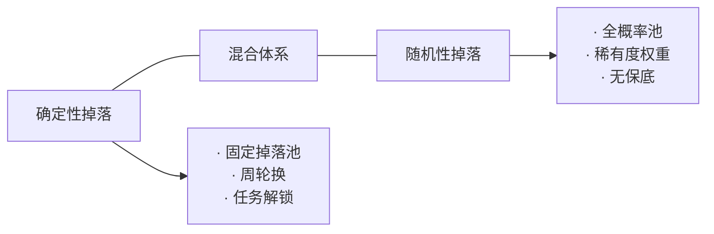

# 确定性 vs 随机性掉落设计

> 标签：`randomness`, `loot-design`, `player-psychology`, `system-design`
> 关联概念：`30-投篮效应.md`, `26-双轨收益与强化程式.md`, `37-信号与强化体系.md`, `69-强制循环.md`

## 设计哲学的两种极端



| 维度           | 确定性（Deterministic）                             | 随机性（Random）                       |
| :------------- | :-------------------------------------------------- | :------------------------------------- |
| **典型游戏**   | Destiny（固定掉落池）、Warframe Prime（指定掉落源） | Diablo系列、Path of Exile、Borderlands |
| **玩家预期**   | "打到这个Boss就会掉"                                | "打这个Boss可能掉"                     |
| **时间尊重**   | 高——玩家知道需要多少时间                            | 低——可能刷100次也不掉                  |
| **重玩性来源** | 挑战成就感、收藏收集                                | 随机惊喜、Build多样性                  |
| **核心体验**   | 掌控感、可规划                                      | 期待感、惊喜峰值                       |

## 两种方向的优劣分析

### 确定性掉落

**优点**：
- 尊重玩家时间（付出必然有回报）
- 玩家可以**规划**收集路径
- 避免非酋陷阱（防止极端运气差的玩家弃坑）
- 容易与任务/成就系统结合

**缺点**：
- 一旦收集完成，重玩动机降低
- 缺少"惊喜时刻"
- 可能导致公式化流程（最优路线固定）
- 装备价值透明化（知道"人人都有"）

### 随机性掉落

**优点**：
- 持续制造期待感和惊喜（投篮效应）
- 延长内容消耗时间
- 创造"我的装备"的独特性
- 可变比率强化 — 最持久的动机维持方式

**缺点**：
- 非酋体验差（长时间无回报）
- 玩家可能归因错误（"系统故意不给"）
- 装备做平衡更难（随机词条组合爆炸）
- 过度使用时变成"刷子游戏"

## 混合策略：取两者之长

优秀的游戏设计通常**结合两者**，而不是极端选择其一。

### 策略一：双轨收益（随机+固定并存）

```
击杀Boss =
  固定掉落（一定有的材料/金币）
  + 随机掉落（概率获得稀有装备）
```

**代表**：Warframe、现代MMORPG

**设计要点**：
- 固定掉落提供**保底满足感**
- 随机掉落创造**惊喜峰值**
- 两者互不干扰（不会因为随机好就取消固定）

> 详见 `理论知识/26-双轨收益与强化程式.md`

### 策略二：定向获取（Targeted Farming）

玩家知道"去哪里打才能得到什么"，但具体出什么属性/词条仍随机。

**示例**：
- Destiny 2：每周特定副本掉落特定武器池
- Warframe：特定敌人掉落特定蓝图的特定部件
- Diablo 3：智能掉落（提高当前职业装备概率）

**设计要点**：
- 明确告知玩家掉落来源
- 缩小随机空间（限定稀有度、词条范围）
- 允许交易（Warframe模式：玩家之间交换补全）

### 策略三：渐进式保底（Pity System）

每次未获得稀有物品时提高下次概率，直到必然触发。

**示例**：
- 各类抽卡游戏的保底机制
- 《原神》90抽保底+180抽硬保底
- 自走棋的商店刷新（等级越高→高费概率越高）

**设计要点**：
- 保底是**安全网**而非主要获取途径
- 保底前后的体验落差感需要平滑
- 与PRD配合使用效果更佳

> 详见 `理论知识/73-伪随机分布PRD.md`

### 策略四：权力下放（Player Agency）

让玩家通过**决策**影响随机结果，将输出随机转化为输入随机。

> 关联概念：`理论知识/22-权力下放设计.md`

**示例**：
- 《背包英雄》铁砧强化：消耗材料必然强化，只是幅度随机
- 自走棋刷新：花钱刷商店（输入随机=决策），而非等随机掉落
- 杀戮尖塔三选一：从3张随机卡中选择1张

**设计要点**：
- 玩家付出资源（金钱/材料/时间）换取对随机的控制
- 让"坏随机"成为可对冲的而非不可控的
- 玩家感到"是我选择了这个结果"而非"运气决定"

## 设计决策框架

```
想设计掉落系统 →
    ├── 玩家时间是否值得被尊重？
    │   ├── 是 → 加入固定掉落/保底
    │   └── 否 → 纯随机（高风险）
    ├── 需要重玩性吗？
    │   ├── 是 → 加入随机元素
    │   └── 否 → 纯确定性
    ├── 玩家能在随机面前做决策吗？
    │   ├── 是 → 加入对冲机制（交易/选择）
    │   └── 否 → 降低随机性
    └── 极端情况可接受吗？
        ├── 是 → 纯随机
        └── 否 → PRD/保底
```

### 实际案例分析

| 游戏              | 策略                              | 为什么这个策略适合该游戏                                         |
| :---------------- | :-------------------------------- | :--------------------------------------------------------------- |
| **Destiny 2**     | 目标性随机（指定副本→指定武器池） | 突袭副本的核心驱动力是挑战，而非刷装备；随机维持了每周重复的动力 |
| **Warframe**      | 指定掉落+玩家交易                 | 经济系统核心是"肝代替氪"——玩家可以刷特定掉落，也可以直接交易     |
| **Path of Exile** | 高随机+经济系统对冲               | 深度经济系统中，随机制造稀缺，交易填补空白                       |
| **原神**          | 双保底+90抽/180抽                 | 降低极端非酋概率，同时维持抽卡的惊喜感                           |
| **Diablo 3**      | 智能掉落+赌装备NPC                | 减少无效掉落，让玩家感觉"刷的时间有回报"                         |

## 与知识库的关联

- `30-投篮效应.md` — 随机掉落的心理学基础：低成本高惊喜
- `26-双轨收益与强化程式.md` — 固定+随机组合的强化框架
- `37-信号与强化体系.md` — 间歇性强化的成瘾性设计
- `69-强制循环.md` — 掉落系统与强制循环的关系
- `16-卡牌设计规范.md` — 卡牌游戏的随机获取与三选一的确定性对冲
- `72-输入随机与输出随机.md` — 输出随机（掉落）vs 输入随机（选择）
- `73-伪随机分布PRD.md` — PRD对掉落系统极端情况的平滑
