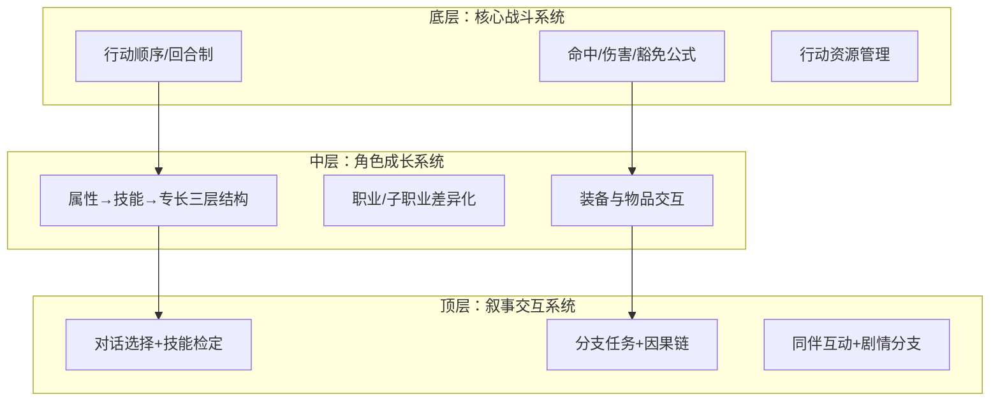

# CRPG角色与系统设计——角色/职业/技能与系统架构

> 标签：`crpg`, `character-design`, `class-design`, `skill-system`, `game-architecture`, `rpg`
> 关联概念：`24-三端分工设计.md`, `35-协同效应.md`, `44-游戏平衡性设计.md`, `45-增量游戏设计.md`, `22-权力下放设计.md`
> 来源：博德之门3（DND 5e）、神界原罪2、永恒之柱、开拓者系列等 CRPG 设计模式分析

---

## 一、角色系统核心架构

### 1.1 三层层级结构

现代 CRPG 的角色系统普遍采用**属性→技能→专长/能力**的三层递进结构。每一层充当下一层的"过滤器"。

```
第一层：基础属性（Attributes）
  └─ 决定角色的先天倾向（力量/敏捷/智力/感知/魅力等）
  └─ 为后续所有系统提供基础数值修正
  └─ 投入成本高，改动代价大（通常开局确定后很难改变）

第二层：技能（Skills）
  └─ 决定角色能做什么（潜行/说服/开锁/察觉等）
  └─ 受基础属性修正 + 投入的技能点数
  └─ 投入成本中等，可随等级提升逐步分配

第三层：专长/能力（Feats/Abilities）
  └─ 决定角色的独特能力（战斗专长/法术/职业特性）
  └─ 有前置条件（属性阈值/技能等级/职业等级）
  └─ 投入成本最大，但回报也最大（质变）
```

**设计原则**：每一层都充当下一层的"守门人"——你需要在属性上投入足够多，才能解锁高级技能；需要特定技能等级，才能解锁专长。这创造了有意义的成长路径。

### 1.2 两种主流属性模型

| 模型 | 代表 | 属性数量 | 特点 |
|:----|:------|:---------|:------|
| **DND 六属性** | 博德之门3、开拓者 | 6 个（力量/敏捷/体质/智力/感知/魅力） | 每属性有明确用途，无废属性 |
| **自定义属性** | 神界原罪2、永恒之柱 | 4-8 个 | 更聚焦游戏的核心循环 |

**DND 六属性的设计智慧**：

| 属性 | 作用 | 高光情境 |
|:-----|:------|:---------|
| **力量** | 近战攻击、负重、威吓 | 推开重门、挣脱束缚 |
| **敏捷** | 远程攻击、先攻、反射豁免、潜行 | 躲避陷阱、先手偷袭 |
| **体质** | 生命值、专注检定 | 维持高难度法术的专注 |
| **智力** | 法术施放、知识类技能 | 破解谜题、识别怪物弱点 |
| **感知** | 洞察、意志豁免 | 识破谎言、抵抗精神控制 |
| **魅力** | 社交、说服/欺骗 | 不战而屈人之兵 |

> **关键设计要点**：没有绝对的废属性。即使"力量"对法师看似无用，但在推门、挣脱束缚等情境中仍有价值。**每个属性在游戏全程至少有一个高光时刻**——这确保了属性投入的"安全感"。

---

## 二、职业系统设计

### 2.1 职业的三种设计哲学

| 哲学 | 代表 | 特点 | 优缺点 |
|:----|:------|:------|:-------|
| **经典职业模型** | DND 5e（博德之门3） | 预设职业+子职业，有明确的角色定位 | ✅ 新手友好，身份认同强 ❌ 灵活性有限 |
| **自由构筑模型** | 神界原罪2 | 无固定职业，由技能点分配自由定义 | ✅ 极高的自由度 ❌ 新手不知从何下手 |
| **混合体系** | 开拓者 | 基础职业+进阶职业+兼职 | ✅ 深度极大 ❌ 学习曲线陡峭 |

### 2.2 经典职业模型的设计维度

职业由以下维度定义：

| 维度 | 说明 | 设计要点 |
|:-----|:------|:---------|
| **生命骰（Hit Dice）** | 每级获得的生命值基准 | 法师 d6 < 游荡者 d8 < 战士 d10 < 野蛮人 d12——职业定位的数值体现 |
| **主要属性** | 职业依赖的核心属性 | 法师→智力，牧师→感知，术士→魅力——强迫玩家在属性投入上做取舍 |
| **职业特性** | 随等级获得的独特能力 | 每个等级都有新内容（特性或法术），**无空等级** |
| **子职业** | 3 级时选择的分支方向 | 战士→冠军/战斗大师/奥法骑士——单职业内的玩法差异化 |
| **施法能力** | 法术位+已知法术 | 法术位（资源管理）vs 已知法术（选择范围） |

**子职业的分化时机**（以博德之门3为例）：
- 所有职业在 **3 级** 选择子职业（刻意统一的时间点）
- 1-2 级是新手适应期，不给过多选择
- 3 级玩家已有基础理解，此时给出分支方向让玩家感受到"我的角色开始与众不同"

### 2.3 自由构筑模型的技能学派设计

以神界原罪2为例，无固定职业，而是通过技能学派来定义角色：

```
开局选择：预设标签（战士/法师/游侠/盗贼）
→ 仅影响初始技能分配
→ 之后完全自由：想学什么技能就学什么技能
→ 技能分为 10 个学派：
  烈火/ Hydromancy/ Aero/ Geo/ Necro/ Summon
  / Warfare/ Scoundrel/ Huntsman/ Polymorph
→ 每个学派有独立的技能树
```

**关键设计决策**：
- 技能学派的等级决定你能学该学派的多高等级的技能
- 但**没有角色等级硬性限制**——1 级也能学高级技能，只要你投入足够的技能点
- 这创造了"极限构筑"空间——牺牲其他所有方向，专精一个学派

---

## 三、技能与能力设计

### 3.1 技能的两种取向

| 取向 | 说明 | 设计原则 |
|:-----|:------|:---------|
| **战斗技能** | 影响战斗效率 | 每投入1点需有可感知的 dps 回报 |
| **对话/探索技能** | 影响非战斗场景 | 需要有明确的情境回报（"因为说服够高，避免了这场战斗"） |

> **关键原则**：对话技能必须与战斗技能有**同等的重要性**。如果战斗是"刚需"而对话只是"锦上添花"，玩家会全部堆战斗技能，非战斗内容被浪费。这在 `理论知识/22-权力下放设计.md` 中对应体验选择权。

### 3.2 技能成长曲线

| 阶段 | 等级范围 | 成长速度 | 设计要点 |
|:-----|:---------|:---------|:---------|
| **初期** | 1-4 级 | 快速 | 每级都有新能力/法术，建立"我在变强"的感觉 |
| **中期** | 5-10 级 | 中速 | 获得核心能力，Build 开始成型 |
| **后期** | 11-16 级 | 慢速 | 获得终极能力，"质变"而非"量变" |
| **终局** | 17-20 级 | 极慢 | 接近半神级能力，属于奖励性内容 |

以博德之门3为例的等级节奏：
- 1-4 级 ≈ 10-15 小时（快速成长期）
- 5-8 级 ≈ 20-30 小时（核心体验期）
- 9-12 级 ≈ 10-15 小时（终局内容）
- 锁 12 级上限（而非 DND 的 20 级）——12 级以上能力过于强大，不适合电子游戏

### 3.3 法术分层设计

| 层级 | 代表法术 | 设计目的 |
|:-----|:---------|:---------|
| **戏法** | 火焰箭、魔法伎俩 | **免费、可随意施放**——即使资源耗尽也能参与战斗 |
| **低环法术（1-3环）** | 燃烧之手、迷雾步 | **核心战斗资源**——需要管理法术位，效果直接 |
| **高环法术（4-6环）** | 火球术、传送门 | **战局改变者**——关键时刻使用，效果令人印象深刻 |

**法术位 vs 冷却时间**两种资源模型的对比：

| 模型 | 代表 | 优点 | 缺点 |
|:-----|:------|:------|:------|
| **法术位（Vancian）** | DND 5e | 长期资源管理，决策重量感 | 新手容易"不舍得用" |
| **冷却时间** | 神界原罪2 | 每场战斗都可用，节奏快 | 缺少长期策略维度 |

---

## 四、系统设计方法论

### 4.1 CRPG 系统的三个设计层次



**设计原则**：每一层只与相邻层交互，避免跨层耦合。战斗系统影响角色成长（通过等级），角色成长影响叙事交互（通过技能检定），但不跨两层耦合。

### 4.2 平衡性的核心矛盾与解法

```
选择自由度 vs 数值平衡性
  ↑                    ↑
玩家想要"我能选什么"    设计师需要"所有选择都是可行的"
```

**解法——功能等价原则**：
- 不同职业/构筑的**输出总量应接近**（DPS/治疗量/控制时长）
- 但**达到的方式和情境应不同**
- 例：战士在单体战斗中强，法师在群体战斗中强——总量接近，情境不同

### 4.3 怪物/敌人设计原则

| 维度 | 说明 |
|:-----|:------|
| **属性对标** | 怪物应有类似角色的属性值和豁免值 |
| **行为模式** | 每种怪物有行为偏向（地精→群殴，巨魔→再生，法师→控场） |
| **挑战评级（CR）** | 作为难度基准，需根据队伍实际强度调整 |
| **传奇抗性** | Boss 级怪物应有防止被单控秒杀的机制 |

**Boss 设计特别要求**：
- Boss 必须有**阶段转换**（血量阈值触发新行为模式）
- Boss 必须有**可读性**（玩家能通过观察预判行动，参考 `知识库/跨项目知识/Boss设计通用规则.md`）
- Boss 战应有**环境要素**（可交互地形、可摧毁柱子、可用特殊机制）

### 4.4 多角色队伍设计

CRPG 区别于单人 RPG 的核心特征——**玩家控制多个角色**：

| 维度 | 设计要点 |
|:-----|:---------|
| **队伍组成** | 4-6 人队伍，含不同角色定位（坦克/输出/治疗/控场） |
| **同伴个性** | 每个同伴有自己的任务线、道德立场、对话风格 |
| **队伍协同** | 不同职业的搭配产生乘法效应（如战士制造倒地→法师对倒地目标追加伤害） |
| **替补机制** | 未上场的同伴在营地/休息处，可随时替换 |

---

## 五、与知识库的关联

| CRPG 设计模式 | 对应理论 | 说明 |
|:-------------|:---------|:------|
| 三层属性结构 | `理论知识/24-三端分工设计.md` | CRPG 的属性/技能/专长就是数值端/中间层/表现端的具体化 |
| 技能成长曲线 | `理论知识/45-增量游戏设计.md` | 等级设计与增量游戏的成长曲线本质一致 |
| 职业差异化 | `理论知识/35-协同效应.md` | 不同职业的协同效果（战士+法师=前排+控场） |
| Boss 行为模式 | `知识库/跨项目知识/Boss设计通用规则.md` | 可解读的谜题、阶段转换、环境要素 |
| 对话技能重要性 | `理论知识/22-权力下放设计.md` | 对话选择是权力下放的核心体现 |
| 自由度 vs 平衡性 | `理论知识/44-游戏平衡性设计.md` | 功能等价原则是平衡性设计的落地方法 |
| 法术位资源管理 | `理论知识/37-信号与强化体系.md` | 资源管理+回报周期的强化程序设计 |

---

## 六、参考作品

| 游戏 | 可借鉴的设计点 |
|:-----|:--------------|
| **博德之门3** | DND 5e 规则的电子游戏化适配、子职业分化时机、对话技能检定的叙事权重 |
| **神界原罪2** | 自由构筑模型、技能学派设计、环境交互战斗 |
| **永恒之柱** | 自定义属性模型、同步回合制战斗设计 |
| **开拓者系列** | 混合职业体系、进阶职业设计、高难度策略深度 |
| **辐射系列** | SPECIAL 属性系统、技能对话检定、分支叙事 |
